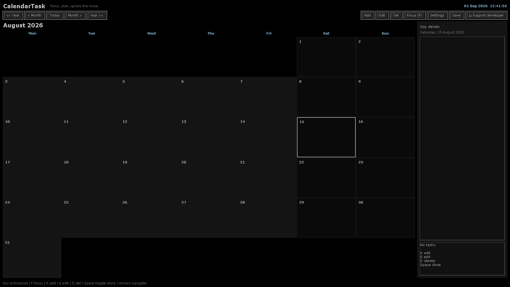

<div align="center">

# VACZEN Calendar

**Distraction-free, single-file calendar and task tracker for people who would rather open a tool than maintain a productivity ecosystem.**

[](#)


[](LICENSE)

[**Run it**](#-install) · [Keyboard](#-keyboard) · [Documentation](docs/overview.md) · [Issues](https://github.com/vacterro/VACZEN-Calendar/issues)



</div>

> Win95-dark by default. One Python file. Zero third-party dependencies.

## 📸 Screenshot
## 📸 Screenshot

## ✨ Features

| | |
|---|---|
| 🎯 **Single file, single concern** | The whole app is `ZEN_CALENDAR.py`. No framework, no package, no vendored copies. |
| 📦 **Zero dependencies** | Python stdlib only. `tkinter`, `json`, `datetime`, `pathlib`. No `pip install`. |
| 🌑 **Win95-dark by default** | Black panels, golden accents, no animations, no antialiasing. Battery-friendly. |
| ⚡ **Keyboard-first** | Every action is one key. Mouse optional. |
| 💾 **Atomic save** | Interprocess-locked, generation-checked writes. Two instances never clobber each other. |
| 🛡️ **Self-healing load** | Bad JSON → quarantine, never overwrite the only copy. Corrupt dates are isolated, not dropped silently. |
| 🪟 **Focus mode** | One key (`f`) hides everything except the calendar. Distraction-proof. |
| ⚙️ **15-color theme** | Background, panels, text, headers, weekend, today, selected, accent — all live-tweakable. |
| 🌍 **i18n** | `lang: ru / en / uk`. Settings key, all UI strings follow. |
| 🔢 **ISO week numbers** | Optional column. |
| 🕐 **Live clock** | Bottom-right, self-rescheduling, never lags. |
| 📐 **Geometry that remembers** | Window size, position, fullscreen, always-on-top. Round-trips through the data file. |

---

## 🚀 Install

```bash
# 1. Clone
git clone https://github.com/vacterro/VACZEN-Calendar.git
cd VACZEN-Calendar

# 2. Run (no install step)
python ZEN_CALENDAR.py
```

That's it. Python 3.11 or newer. No virtualenv needed — there is nothing
to install. On Windows you can also rename to `.pyw` or launch via
`pythonw.exe` for a console-less run.

---

## ⌨️ Keyboard

Every binding below is suppressed while you type in an editor or while
the Settings panel is open, so you never lose a draft to a stray keypress.

| Key | Action |
|---|---|
| `←` / `→` | Previous / next month |
| `↑` / `↓` | Previous / next year |
| `f` | Toggle **focus mode** |
| `a` | Add task to selected day |
| `e` | Edit selected task |
| `d` | Delete selected task |
| `s` | Save now |
| `Space` | Toggle done on selected task |
| `Return` | Editor → commit; elsewhere → refresh detail box |
| `Esc` | Settings open → close; editing → cancel; else quit |
| `Ctrl+K` | Toggle settings panel |

---

## 📂 Project layout

```
VACZEN-Calendar/
├── ZEN_CALENDAR.py          ← the entire app
├── CalendarTask_data.json   ← your tasks (auto-created, gitignored)
├── ZenCalendar_data.json    ← (legacy) alt name for the same file
├── docs/                    ← architecture & reference
│   ├── overview.md
│   ├── architecture.md
│   ├── data-model.md
│   ├── ui-and-rendering.md
│   ├── settings.md
│   ├── keyboard.md
│   └── canonical-ids.md
├── README.md                ← you are here
├── README.et.md             ← eesti
├── README.ru.md             ← русский
├── CONTRIBUTING.md
└── LICENSE                  ← MIT
```

---

## 📚 Documentation

| Doc | What it covers |
|---|---|
| [Overview](docs/overview.md) | What the app is, what it isn't. |
| [Architecture](docs/architecture.md) | Method-by-method map of `ZEN_CALENDAR.py`. No hand-waving. |
| [Data model](docs/data-model.md) | JSON shape, atomic save, quarantine, recovery. |
| [UI & rendering](docs/ui-and-rendering.md) | Theme, fonts, geometry, focus mode. |
| [Settings](docs/settings.md) | `DEFAULT_SETTINGS`, the validation contract, the apply pipeline. |
| [Keyboard](docs/keyboard.md) | The full key → handler table. |
| [Canonical IDs](docs/canonical-ids.md) | The names a refactor must not break. |

---

## 🤝 Contributing

Issues and PRs welcome. Bug reports: include your OS, Python version
(`python --version`), and the contents of the data file (or a
redacted excerpt — paths and notes can be sanitised).

For substantial changes, open an issue first so we can agree on the
shape before you spend a weekend on it. See [CONTRIBUTING.md](CONTRIBUTING.md).

---

## ❤️ Support

If this keeps you off your phone and in front of your actual schedule:

<a href="https://buymeacoffee.com/vacuum34"></a>

---

## 📜 License

[MIT](LICENSE) — do what you want, just keep the copyright line.

---

<p align="center">
  <sub>VACZEN Calendar · v0.0.1 · single file · zero deps · keyboard-first</sub>
</p>

<!-- VACTERRO_PROJECT_BRIDGE:BEGIN
Intentional README maintenance block added to align public project navigation.
Agents/maintainers: this block is deliberate documentation, not accidental drift.
Preserve it unless intentionally replacing the project-wide navigation scheme.
-->
---

## Project network

This repository is connected to the broader **SAIPEN / vacterro** project network.

[**Author hub**](https://github.com/vacterro) · [**SAIPEN HQ**](https://github.com/saipenhq) · [**SAIPEN Core**](https://github.com/vacterro/saipen) · [**ZAICODE**](https://github.com/vacterro/zaicode) · [**FastPrompter**](https://github.com/vacterro/FastPrompter) · [**SAIPEN Community**](https://discord.gg/SEYaYkuVgN)

For reproducible bugs and durable feature requests, use [this repository's GitHub Issues](https://github.com/vacterro/VACZEN-Calendar/issues). Use Discord for quick discussion, screenshots, and cross-project feedback.

<!-- VACTERRO_PROJECT_BRIDGE:END -->

<!-- VACTERRO_SUPPORT:BEGIN -->
---
<sub>If this project is useful to you, optional support: [Buy Me a Coffee](https://buymeacoffee.com/vacuum34) · [Boosty](https://boosty.to/vacuum34/donate) · [PayPal](https://paypal.me/AlexNelin) · [other ways](https://github.com/vacterro/vacterro/blob/main/SUPPORT.md)</sub>
<!-- VACTERRO_SUPPORT:END -->
